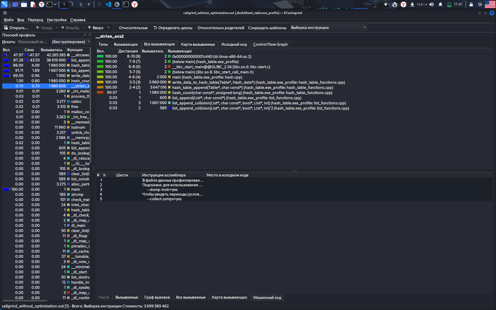
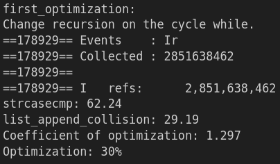
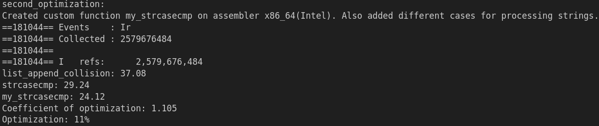
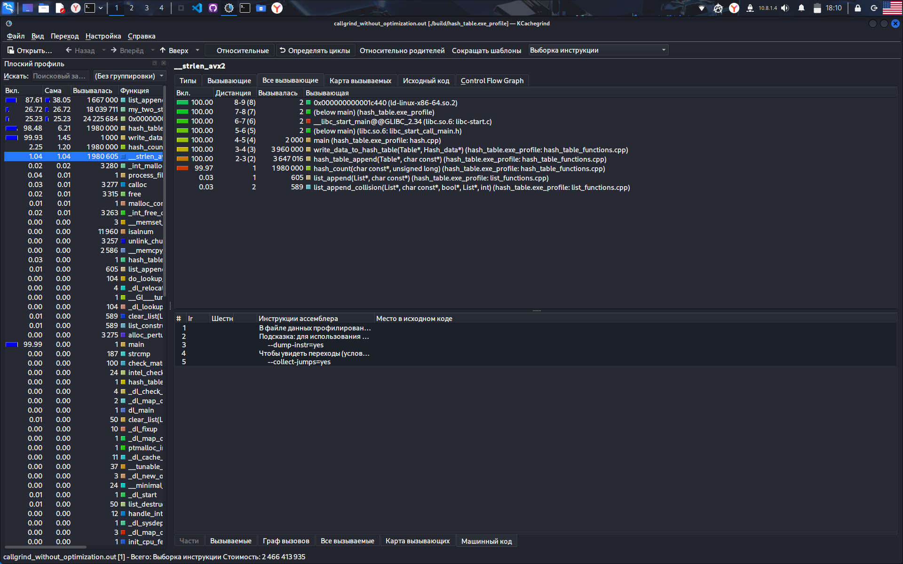
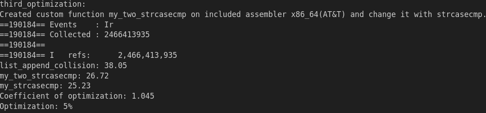

# Hash Table
*A research assignment for a deeper understanding of the compiler and optimization methods.*  

---

## Introduction  
This project is intended for a more detailed analysis of compiler tools and ways to optimize various programs.  Working with a hash table is considered as an optimization program. *A little background: A hash table is an unordered data structure consisting of key-value pairs. The hash table is based on an array of linked lists.*

**Key Goals**:  
- ✅ Goal 1: Learn how to use special tools to track bottlenecks (profilers).
- ✅ Goal 2: Explore different ways to optimize programm.
- ✅ Goal 3: Implement different options and compare them.

---

## Technical Specifications  
- **Compiler**: `g++` (GCC, version 14.2.0)  
- **IDE**: Microsoft VSCode
- **OS**: Kali Linux (version 2025.2)  
- **CPU**: Intel Core i7 13700H (2.4 GHz)
- **Profiler**: Valgrind(Call Grind)

**Build Requirements**:  
- C++17 or later  
- CMake

---
## Research Information
A part of J.R.R. Tolkien's novel "The Lord of the Rings" was used as data for entering into the hash table.*All rights to the work, as well as the publication, belong to **Embracer Group**.*
### Without optimization
Version without optimization has **3699589462** instructions of processor. Some infromation from profiler:


### First optimization
The first optimization is to replace recursion in the list_append_collision function to add a value to the hash table with a **while loop**. Information:



### Second optimization
The second optimization contains two stages. The first is writing your own string comparison function in pure x86_64 assembler (Intel syntax) and linking it to the main program. The second is the use of different string comparison functions in cases of even or odd hashes, since tracking revealed that collisions are more common on even hashes.Some infromation:



### Third(Last) Optimization
The goal of the third optimization was to get rid of the built-in string comparison function. Therefore, a string comparison function was written using the built-in assembler (AT&T syntax). Some information:



---

## Conclusion  
**Summary**:
The overall optimization of the program was 46%. Optimizations were used by improving the **C algorithm**, using **pure x86_64 assembler** (Intel syntax), and using **embedded x86_64 assembler** (AT&T syntax).

**Get Started**:  
```bash  
$ git clone https://github.com/ZEVS1206/Hash_Table.git 
$ cd Hash_Table
```
If you want just started programm without graphical display:
```bash
$ make clean
$ make
$ make run
```
If you want started programm with graphical display:
```bash
$ make clean
$ make
$ make run flag=-y
```
And then go to folder *dump*, here image of hash table.
If you want started programm with callgrind(profiler):
```bash
$ make clean
$ make
$ make callgrind
```
Then, if you want to open profiler:
```bash
$ kcachegrind callgrind.out
```
**License**: "MIT" 
